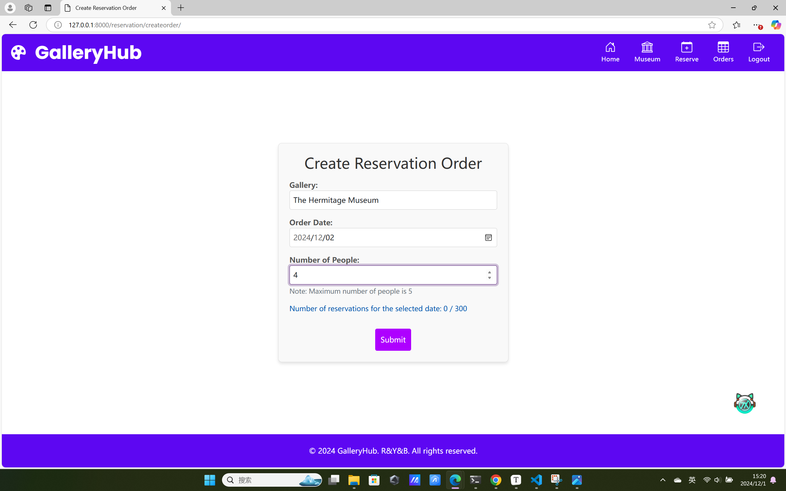
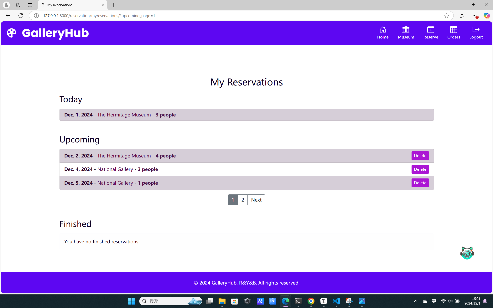

# Galley-Hub

This project is an art gallery website based on `python3.8` and `Django4.0`. Visitors can browse gallery information and make reservations.  Administrators can manage galleries, artwork and user reservations.

## Contents

[Main Features](#main-features) 

[Installation and Setup](#installation-and-setup) 

[Quick Demo ](#quick-demo) 


## Main Features

- **User registration and login**

  Users can create an account and log in to access personalized features such as reservations and detailed artwork information.

- **Browse gallery information**

  Users can explore galleries and view detailed information about the artworks displayed in each gallery. For each artwork, users can:

  - View its detailed information, including description, associated styles and author.
  - Discover similar artworks based on shared styles.
  - Discover other artworks by the same author.

- **Reservation system**

  Users can make reservations to visit galleries, with the following restrictions:

  - Each user has a daily limit on the number of people they can include in their reservation.
  - Each gallery has a visitor capacity.

- **Admin Management**

  Administrators can manage galleries, artworks, styles, and author information. Admin-specific features include:

  - Editing gallery details, such as name and visitor capacity.

  - Updating artwork information, including changing the gallery where an artwork is displayed.

  - Modifying or assigning styles and authors to specific artworks.

  - Adding, deleting, or updating styles and authors in the system.

  - Admin privileges are assigned and managed exclusively by the root user.


## Installation and Setup

You can install and run the project in one of the following ways: setting up the environment with Docker. or using `pip` to install dependencies

**Option 1: Install with Docker (Recommended)**

1. **Clone the repository or unzip the code package**

   ```
   git clone https://github.com/laurel-yyy/galleryhub.git
   ```

2. **Build Docker image** 

   ```
   cd galleryhub/gallery
   ```

   ```
   docker build -t galleryhub_env .
   ```

3. **Run the Docker container**

   ```
   docker run -d -p 8000:8000 galleryhub_env
   ```

4. **Access the application** Open a browser and visit `http://localhost:8000/`.


**Option 2: Install with pip**

1. **Clone the repository or unzip the code package**

   ```
   git clone https://github.com/laurel-yyy/galleryhub.git
   ```

2. **Set up virtual environment**

   ```
   python -m venv env
   source env/bin/activate
   ```

3. **Install dependencies**

   ```
   pip install django pillow django-widget-tweaks
   ```

4. **Run Server**

   ```
   python manage.py runserver
   ```

5. **Access the application** Open a browser and visit `http://127.0.0.1:8000/`.


## Quick Demo

1. **Register and Login**

   

   

   

2. **browse gallery information**

   the recommendation changes each time you reload the home page.

   
   
   
   
   
   
   
   

   

   

3. **make reservation**

   :mega::mega::mega:Only accessible to logined users.:mega::mega::mega:

   the max number of people of a reservation is 5. 

   after the user choose the date and gallery, the page will show the remaining capacity for the selected day.

   an account can only make reservation on the same day once. and users can delete their upcoming reservations.

   if the reservation can't satisfy any of the limit, the submission will fail and the page will show the error message. Otherwise the user will be redirected to the` my reservation` page.

   
   


4. **admin page**

   :mega::mega::mega:Only staff users are allowed to these pages:mega::mega::mega:

   Others will see an error message and be blocked and redirected to the home page.

   The default superuser's user name is root, password is 123456. We also created a default admin  account whose user name is alice, password is 123456.

   To add your new admin, go to the url `localhost:8000/admin/`, login root user, and the click the `is staff` checkbox of your new user. 

   

   you can get to the edit page by clicking the `edit` button on gallery info page.

   

   

   

   
   
   


